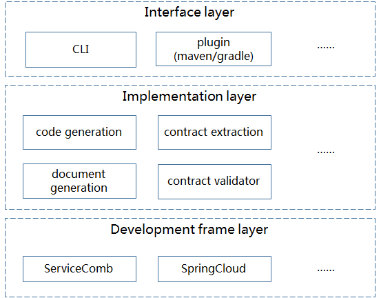

# toolkit

基于契约的微服务开发工具套件

## 1 简介

### 1.1 目标

* 快速构建基于流行微服务框架和编程模型的微服务工程，并提供服务契约、代码、文档的一体化制作能力，帮助基于服务契约开发的用户在微服务转型阶段，降低微服务入门成本，聚焦业务开发，提升遗留系统重构、开发效率。

### 1.2 功能

* 代码提取服务契约

  在基于SpringMVC/POJO/JAX-RS模型开发的应用中，一键生成符合OpenAPI规范的服务契约文件。

* 服务契约生成微服务工程

  输入符合OpenAPI规范的服务契约，一键生成以ServiceComb/SpringCloud/Swagger为底座，以及以SpringMVC/POJO/JAX-RS或SpringBoot为开发模型的微服务项目。

* 服务契约与代码一致性校验

  校验应用的实际实现（如数据和服务API）是否与达成共识的服务契约描述一致。

* 服务契约/代码生成文档

  输入符合OpenAPI规范的服务契约，一键生成html/word/pdf格式的文档。

### 1.3 适用场景

* 集成多厂商应用的企业

  问题：厂商数据、服务标准不一致，开发语言、习惯、框架不一致，集成商难集成，企业难管控。

  措施：通过统一定义的接口描述标准（服务契约），使用工具套件一键生成基于指定微服务框架的微服务工程，并且通过服务契约校验手段协同维护整体系统的一致性。以此协调多个开发团队，降低沟通成本且避免后期的混乱。

* 遗留系统微服务化快速改造

  问题：用户需要额外学习和理解微服务及相关框架后，再设计微服务工程，学习成本高。

  措施：使用工具套件分析遗留应用提取服务契约，再一键生成基于指定微服务框架的微服务工程后，即可聚焦业务开发，减少用户对微服务框架的学习成本。

## 2 设计

### 2.1 主体架构



### 2.2 工作原理


## 3 快速入门
### 3.1 从源码构建工具和插件
构建环境要求:

* [Java 8](http://java.oracle.com)

* [Apache maven 3.5.0 or greater](http://maven.apache.org/)

```shell
# 从github获取toolkit最新源码
$ git clone https://github.com/MabinGo/toolkit.git
$ cd toolkit

# 构建打包
$ mvn clean install
```

### 3.2 使用toolkit-cli工具
可执行jar包位于toolkit/toolkit-cli/target目录下
```shell
$ java -jar toolkit-cli.jar help
```
#### 3.2.1 契约生成微服务工程
```shell
$ java -jar toolkit-cli.jar  codegenerate -m ServiceComb -i swagger.yaml -o ./project -p SpringMVC
```
> codegenerate命令选项说明:
* -m, --microservice-framework : 指定微服务框架,现支持ServiceComb  
例：-m ServiceComb
* -p, --programming-model : 指定编程模型，可选JAX-RS，POJO，SpringMVC，SpringBoot  
例：-p SpringMvc
* -i, --input : 指定遵循OpenAPI规范的契约文件，支持yaml和json格式，支持指定本地和网络文件  
例：-i http://petstore.swagger.io/v2/swagger.json
* -o, --output : 生成的项目代码输出路径  
例：-o ./project
* --group-id : 指定生成的项目的group id  
例：--group-id com.demo
* --artifact-id : 指定生成的项目的artifact id     
例：--artifact-id springmvc-example
* --artifact-version : 指定生成的项目的artifact version  
例：--artifact-version 1.0.0

#### 3.2.2 契约生成文档
```shell
$ java -jar toolkit-cli.jar  docgenerate -i swagger.yaml -o ./document
```
> docGenerate命令选项说明:
* -i, --input : 指定遵循OpenAPI规范的契约文件，支持yaml和json格式，支持指定本地和网络文件  
例：-i http://petstore.swagger.io/v2/swagger.json
* -o, --output : 文档输出路径   
例：-o ./document
* -f, --format : 指定输出文档风格,现支持swagger-ui和asciidoc-html  
例：-f swagger-ui

### 3.3 使用toolkit-maven-plugin插件
#### 3.3.1 配置
在maven项目的pom文件中配置
```xml
<plugin>
    <groupId>org.apache.servicecomb</groupId>
    <artifactId>toolkit-maven-plugin</artifactId>
    <version>0.1.0-SNAPSHOT</version>
    <configuration>
        <!-- 契约生成目录，默认contracts -->
        <outputDir>contracts</outputDir>
        <!-- 标准的契约放置的目录，默认sourceContracts  -->
        <sourceContractsDir>sourceContracts</sourceContractsDir>  
        <!-- 文档生成目录，默认build/doc -->
        <docOutputDir>build/doc</docOutputDir>
    </configuration>
</plugin>
```
#### 3.3.2 从代码提取契约

运行
```shell
mvn toolkit:generateContracts
```

配置项
* outputDir : 生成的契约文件输出路径，默认contracts  
例：
```shell
<outputDir>contracts</outputDir>
```

#### 3.3.3 从代码生成文档

运行
```shell
mvn toolkit:generateDoc
```

配置项
* outputDir : 生成的契约文件输出路径，默认contracts
* docOutputDir : 生成的契约文档输出路径，默认build/doc

例：
```shell
<outputDir>contracts</outputDir>
<docOutputDir>build/doc</docOutputDir>
```

#### 3.3.4 契约校验

运行
```shell
mvn toolkit:verifyContracts
```

配置项
* outputDir : 生成的契约文件输出路径，默认当前目录下contracts目录
* sourceContractsDir : 共识契约存放路径，默认当前目录下sourceContracts目录
例：
```xml
<outputDir>contracts</outputDir>
<sourceContractsDir>sourceContracts</sourceContractsDir>
```

## 4 反馈问题

Bugs: [issues](https://github.com/MabinGo/toolkit/issues)

## 5 参与开发

PR: [Pull request](https://github.com/MabinGo/toolkit/pulls)
